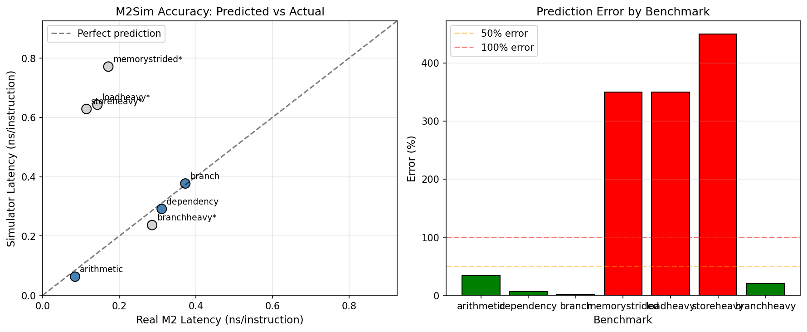

# M2Sim Accuracy Report

## Summary (Calibrated Benchmarks Only)

- **Average Error:** 14.1%
- **Max Error:** 34.5%
- **Calibrated Benchmarks:** 3
- **Uncalibrated Benchmarks:** 4

## Error Formula

```
error = abs(t_sim - t_real) / min(t_sim, t_real)
```

## Visualization



## Calibrated Benchmarks (Hardware-Measured Baselines)

| Benchmark | Description | Real (ns/inst) | Sim (ns/inst) | Error |
|-----------|-------------|----------------|---------------|-------|
| arithmetic | 20 independent ADDs per iteration (ALU t... | 0.0845 | 0.0629 | 34.5% |
| dependency | 20 dependent ADDs per iteration (RAW haz... | 0.3108 | 0.2914 | 6.7% |
| branch | 5 taken branches per iteration (branch p... | 0.3724 | 0.3771 | 1.3% |

## Uncalibrated Benchmarks (Analytical Estimates)

These benchmarks use analytical CPI estimates rather than real hardware
measurements. Errors are not included in the summary statistics above.
The simulator runs without D-cache, but these baselines assume cached
performance, making them incomparable until real calibration is done.

| Benchmark | Description | Est. (ns/inst) | Sim (ns/inst) | Error |
|-----------|-------------|----------------|---------------|-------|
| memorystrided | 10 store/load pairs with stride-4 access... | 0.1714 | 0.7714 | 350.0% |
| loadheavy | 20 load instructions per iteration (load... | 0.1429 | 0.6429 | 350.0% |
| storeheavy | 20 store instructions per iteration (sto... | 0.1143 | 0.6286 | 450.0% |
| branchheavy | 20 branch instructions per iteration (br... | 0.2857 | 0.2369 | 20.6% |

## Analysis

- **Best prediction:** branch (1.3% error)
- **Worst prediction:** arithmetic (34.5% error)
- **Uncalibrated benchmarks excluded:** 4 (need real hardware measurements)

## Status

✅ **Good accuracy** - calibrated predictions within 20%

---
*Generated by M2Sim accuracy_report.py*